<p align="center">
  
</p>

<h1 align="center">CrypShare</h1>

<p align="center">
  <strong>Zero-Knowledge File Sharing for the Paranoid</strong>
</p>

<p align="center">
  <a href="LICENSE"></a>
  
  
  
  
</p>

<p align="center">
  End-to-end encrypted file sharing where <strong>the server learns nothing</strong>.<br/>
  No accounts. No tracking. No trust required.
</p>

---

## 🔐 What is CrypShare?

CrypShare is a **cryptographically hardened file-sharing platform** that implements true zero-knowledge architecture. Files are encrypted entirely on the client using AES-256-GCM before upload—the server only ever sees ciphertext. Recipients decrypt locally using either a shareable link key or identity-based encryption with ECDH key exchange.

Unlike traditional file-sharing services, CrypShare is designed so that even a **malicious server operator** cannot access your files, identify recipients, or tamper with metadata without detection.

---

## ✨ Key Features

### 🚀 Two Sharing Modes

| Mode             | Description                                                     | Best For                              |
| ---------------- | --------------------------------------------------------------- | ------------------------------------- |
| **Quick Share**  | Anonymous, link-based sharing with key embedded in URL fragment | One-time transfers, no setup required |
| **Secure Share** | Identity-based encryption for specific recipients               | Recurring contacts, maximum security  |

### 🛡️ The Six Pillars of Security

| Pillar                | Threat                      | Solution                                              |
| --------------------- | --------------------------- | ----------------------------------------------------- |
| **🔒 Integrity**      | Malicious Admin tampering   | Database triggers + client-side hash verification     |
| **⚡ DoS Protection** | Resource exhaustion attacks | Statement timeouts + input validation                 |
| **🎭 MITM Defense**   | Key substitution attacks    | Client-side fingerprint computation                   |
| **👁️ Privacy**        | Social graph enumeration    | Segregated recipient vault with fingerprint-based RPC |
| **💾 Data Safety**    | Key loss / device change    | PBKDF2-encrypted identity backups                     |
| **🗑️ Infrastructure** | Ghost file accumulation     | R2 Lifecycle Rules for auto-cleanup                   |

---

## 🏗️ Architecture

```mermaid
flowchart TB
    subgraph Client ["🖥️ Client (Browser)"]
        UI[Web UI]
        WC[WebCrypto API]
        IDB[(IndexedDB<br/>Identity Vault)]
    end

    subgraph Server ["⚙️ Backend (Node.js)"]
        API[Express API]
        VAL{Validation<br/>& Rate Limiting}
    end

    subgraph Storage ["☁️ Cloud Infrastructure"]
        R2[(Cloudflare R2<br/>Encrypted Blobs)]
        SB[(Supabase<br/>Metadata + Keys)]
    end

    subgraph SB_Detail ["Supabase Tables"]
        FILES[files<br/>Public Metadata]
        RECIP[file_recipients<br/>🔐 Zero-Knowledge Vault]
        PUBKEYS[public_keys<br/>Identity Directory]
    end

    UI -->|1. Select File| WC
    WC -->|2. Generate AES Key| WC
    WC -->|3. Encrypt File| WC
    WC -->|4. Encrypt Key for Recipients| WC

    WC -->|5. Upload Ciphertext| API
    API --> VAL
    VAL -->|6. Store Blob| R2
    VAL -->|7. Store Metadata| FILES
    VAL -->|8. Store Recipient Keys| RECIP

    IDB -.->|Load Identity| WC
    PUBKEYS -.->|Lookup Recipients| API

    style RECIP fill:#1a1a2e,stroke:#00ff41,stroke-width:2px
    style WC fill:#1a1a2e,stroke:#00d4ff,stroke-width:2px
    style IDB fill:#1a1a2e,stroke:#8b5cf6,stroke-width:2px
```



### Data Flow

1. **Encryption** happens entirely in the browser using the Web Crypto API
2. **Upload** sends only ciphertext—the server never sees plaintext
3. **Metadata** is stored separately from encrypted blobs (defense in depth)
4. **Recipient Keys** are stored in a segregated vault—recipients cannot see each other
5. **Download** retrieves ciphertext, decryption happens client-side

---

## 🔬 Security Model

### Zero-Knowledge Guarantees

| Data            | Server Knows           | Server Cannot Know    |
| --------------- | ---------------------- | --------------------- |
| File Content    | ❌ Ciphertext only     | ✅ Plaintext          |
| File Name       | ❌ Encrypted in blob   | ✅ Original filename  |
| Recipients      | ❌ Fingerprints only   | ✅ Who can decrypt    |
| Sender Identity | ⚠️ Optional signature  | ✅ Without signing    |
| Access Patterns | ⚠️ Download timestamps | ✅ Decryption success |

### The "Double Lock" Integrity System

```sql
-- Database trigger prevents tampering with critical fields
CREATE TRIGGER prevent_file_tampering
  BEFORE UPDATE ON files
  FOR EACH ROW
  EXECUTE FUNCTION prevent_file_tampering();
```

Even with database access, an attacker cannot:

- Modify content hashes (detected client-side)
- Extend file expiry (trigger blocks it)
- Swap encrypted keys (fingerprint mismatch)

### Client-Side Fingerprint Verification

```javascript
// MITM Protection: Never trust server-provided fingerprints
const computedFingerprint = await generateKeyFingerprint(publicKey);
// Compare against claimed fingerprint before encrypting
```

The client computes fingerprints locally from public keys using canonical JSON + SHA-256. This prevents key substitution attacks where a malicious server could inject its own keys.

### Segregated Recipient Vault

```
┌─────────────────────────────────────────────────────────┐
│  files table (public)                                   │
│  ├─ id, size, content_hash, expires_at                 │
│  └─ metadata (accessModes, signature, etc.)            │
├─────────────────────────────────────────────────────────┤
│  file_recipients table (RLS protected)                  │
│  ├─ file_id                                             │
│  ├─ recipient_fingerprint  ← Lookup key                │
│  └─ encrypted_key          ← Only useful to recipient  │
└─────────────────────────────────────────────────────────┘
```

Recipients query only by their fingerprint—they cannot enumerate other recipients. Even the server cannot determine who else has access.

---

## 🚀 Getting Started

### Prerequisites

- **Node.js** 22+
- **Supabase** account (free tier works)
- **Cloudflare R2** bucket (free tier: 10GB)

### Environment Variables

Create a `.env` file in the `backend/` directory:

```env
# Server
PORT=3000
NODE_ENV=production

# Supabase (Database)
SUPABASE_URL=https://your-project.supabase.co
SUPABASE_SERVICE_KEY=eyJ...your-service-key

# Cloudflare R2 (Storage)
R2_ACCOUNT_ID=your-account-id
R2_ACCESS_KEY_ID=your-access-key
R2_SECRET_ACCESS_KEY=your-secret-key
R2_BUCKET_NAME=crypshare-files
R2_PUBLIC_URL=https://your-bucket.r2.dev
```

### Database Setup

1. Go to your Supabase SQL Editor
2. Execute the schema file:

```bash
# The schema includes:
# - Tables: files, file_recipients, public_keys, upload_tokens, ownership_nonces
# - RLS Policies: Default-deny with RPC-only access
# - Triggers: Integrity protection, auto-cleanup
# - Functions: Secure metadata/key retrieval RPCs
```

```sql
-- Run the complete schema
\i backend/schema.sql
```

### R2 Lifecycle Rules

Configure automatic cleanup in Cloudflare Dashboard:

| Rule                     | Action | Condition      |
| ------------------------ | ------ | -------------- |
| Abort Incomplete Uploads | Delete | After 1 day    |
| Delete Expired Files     | Delete | After 8 days\* |

_\*7 days max expiry + 1 day buffer_

### Installation

```bash
# Clone the repository
git clone https://github.com/Iosif-Christogeorgos/Individual-Project.git
cd Individual-Project

# Install backend dependencies
cd backend
npm install

# Start the server
npm start

# Open http://localhost:3000
```

---

## 📖 Usage Guide

### Quick Share (Anonymous)

1. Navigate to **Quick Share**
2. Select expiry time (1h - 7 days)
3. Drop or select a file
4. Click **Encrypt & Upload**
5. Share the generated link (key is in URL fragment `#`)

> 💡 The key after `#` never leaves your browser—it's not sent to the server.

### Secure Share (Identity-Based)

1. Navigate to **Secure Share**
2. **First time?** Create your identity:
   - Enter a username
   - Your cryptographic keypair is generated locally
   - Only the public key is published
3. Add recipients by searching their username
4. Select recipients and upload
5. Share the link—only selected recipients can decrypt

### Identity Backup

1. Click **Export Backup** in the Identity Vault
2. Enter a strong password (min 8 characters)
3. Download the encrypted `.json` file
4. Store it safely—this is your recovery key

> ⚠️ **If you lose both your browser data AND backup, your identity is gone forever.**

---

## 🔧 API Reference

### File Operations

| Endpoint                              | Method | Description                          |
| ------------------------------------- | ------ | ------------------------------------ |
| `/upload`                             | `POST` | Request upload URL and token         |
| `/metadata/:fileId`                   | `POST` | Store file metadata (requires token) |
| `/metadata/:fileId`                   | `GET`  | Retrieve file metadata               |
| `/recipient-key/:fileId/:fingerprint` | `GET`  | Get encrypted key for recipient      |

### Identity Operations

| Endpoint                           | Method | Description                       |
| ---------------------------------- | ------ | --------------------------------- |
| `/pubkey`                          | `POST` | Register public key with username |
| `/pubkey/username/:username`       | `GET`  | Lookup user by username           |
| `/pubkey/fingerprint/:fingerprint` | `GET`  | Lookup user by fingerprint        |

---

## 🧪 Cryptographic Primitives

| Purpose           | Algorithm        | Parameters                          |
| ----------------- | ---------------- | ----------------------------------- |
| File Encryption   | AES-256-GCM      | 256-bit key, 96-bit IV, 64KB chunks |
| Key Exchange      | ECDH             | P-256 (secp256r1)                   |
| Signatures        | ECDSA            | P-256 + SHA-256                     |
| Fingerprints      | SHA-256          | Canonical JSON of JWK               |
| Backup Encryption | PBKDF2 + AES-GCM | 100,000 iterations, 256-bit key     |

---

## 📁 Project Structure

```
CrypShare/
├── backend/
│   ├── server.js           # Express API server
│   ├── schema.sql          # Complete database schema
│   ├── package.json
│   └── tests/
│       └── server.test.js
├── frontend/
│   ├── index.html          # Landing page
│   ├── quick.html          # Quick Share UI
│   ├── secure.html         # Secure Share UI
│   ├── download.html       # Download & decrypt UI
│   ├── crypto.js           # WebCrypto operations
│   ├── identity.js         # Identity management
│   ├── secure.js           # Secure Share logic
│   ├── quick.js            # Quick Share logic
│   ├── download.js         # Download logic
│   └── styles.css          # Cyber-glass design
├── Dockerfile
├── LICENSE
└── README.md
```

---

## 🛡️ Security Considerations

### What CrypShare Protects Against

✅ Server compromise (data is encrypted client-side)  
✅ Database breach (no plaintext, no correlation)  
✅ Man-in-the-middle (client-side fingerprint verification)  
✅ Metadata tampering (database triggers + client verification)  
✅ Social graph analysis (segregated recipient vault)  
✅ Replay attacks (nonce-protected ownership proofs)

### What CrypShare Does NOT Protect Against

❌ Compromised client device  
❌ Weak passwords for identity backup  
❌ Shoulder surfing / screen capture  
❌ Coerced key disclosure  
❌ Traffic analysis (timing, file sizes)

---

## 📄 License

This project is licensed under the MIT License - see the [LICENSE](LICENSE) file for details.

---

## 🙏 Acknowledgments

- [Web Crypto API](https://developer.mozilla.org/en-US/docs/Web/API/Web_Crypto_API) - Browser-native cryptography
- [Supabase](https://supabase.com) - Open source Firebase alternative
- [Cloudflare R2](https://www.cloudflare.com/r2/) - S3-compatible object storage
- [Lucide Icons](https://lucide.dev) - Beautiful open source icons

---

<p align="center">
  <strong>Built with ❤️ and Cryptography</strong>
</p>
